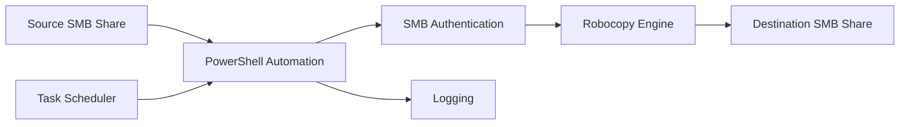

# Architecture Overview

## Workflow

1. Source files arrive in a network share.
2. PowerShell automation validates connectivity.
3. SMB authentication is performed.
4. Robocopy transfers files securely.
5. Files are written to the destination share.
6. Logging captures execution details.
7. Windows Task Scheduler executes the automation periodically.

## High-Level Architecture

## Components

### PowerShell
Automation engine responsible for orchestration.

### SMB
Provides secure network share access.

### Robocopy
Handles file movement and retry logic.

### Task Scheduler
Provides unattended execution.

### Logging
Captures operational and troubleshooting data.
